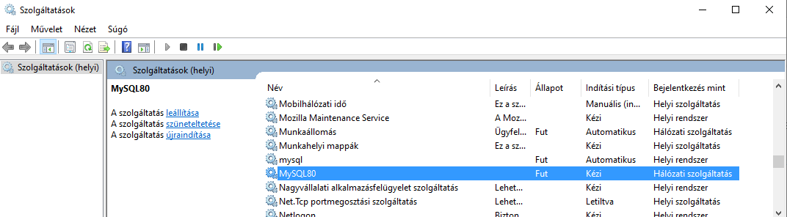
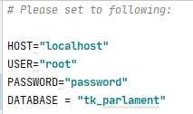
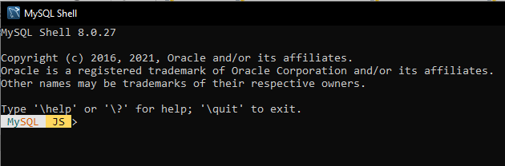
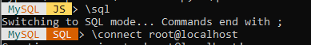
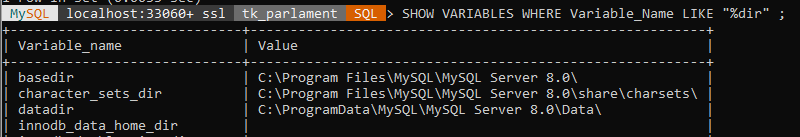

### SQL/JSON corpus generator

This project is intended to support automatic SQL corpus generation from `.xlsx` input file. 

### Schema definition

| Tables_in_tk_parlament |
| :------------------------: |
| cap_kod                |
| conll_szo              |
| felszolalas            |
| kepviselo              |
| kodolja                |
| mondat                 |
| parlamenti_ciklus      |
| part                   |
 

**CAP_KOD** 

| Field      | Type         | Null | Key | Default | Extra |
|------------|--------------|------|-----|---------|-------|
| cap_id     | int          | NO   | PRI | NULL    |       |
| nev_magyar | varchar(100) | YES  |     | NULL    |       |
| nev_angol  | varchar(100) | YES  |     | NULL    |       |

**CONLL_SZO**

| Field          | Type         | Null | Key | Default | Extra |
|----------------|--------------|------|-----|---------|-------|
| szo_id         | int          | NO   | PRI | NULL    |       |
| sorszam        | int          | YES  |     | NULL    |       |
| szoalak        | varchar(40)  | YES  |     | NULL    |       |
| lemma          | varchar(40)  | YES  |     | NULL    |       |
| entity_IOB     | varchar(10)  | YES  |     | NULL    |       |
| POS            | varchar(20)  | YES  |     | NULL    |       |
| morf_analysis  | varchar(100) | YES  |     | NULL    |       |
| dependencia_el | varchar(20)  | YES  |     | NULL    |       |
| mondat_id      | int          | YES  | MUL | NULL    |       |

**FELSZOLALAS**

| Field                 | Type         | Null | Key | Default | Extra |
|-----------------------|--------------|------|-----|---------|-------|
| text_id               | varchar(20)  | NO   | PRI | NULL    |       |
| exact_date            | date         | YES  |     | NULL    |       |
| tokenszam             | int          | YES  |     | NULL    |       |
| text                  | text         | YES  |     | NULL    |       |
| napirendi_pont        | varchar(200) | YES  |     | NULL    |       |
| video_felszolalas_ido | time         | YES  |     | NULL    |       |
| video_feszolalas_url  | varchar(200) | YES  |     | NULL    |       |
| felszolalas_url       | varchar(500) | YES  |     | NULL    |       |
| cycle_number          | int          | YES  | MUL | NULL    |       |
| parliamentary_id      | varchar(20)  | YES  | MUL | NULL    |       |

**KEPVISELO**

| Field            | Type         | Null | Key | Default | Extra |
|------------------|--------------|------|----|---------|-------|
| parliamentary_id | varchar(100) | NO   | PRI | NULL    |       |
| seat_type        | varchar(20)  | YES  |     | NULL    |       |
| seniority        | varchar(20)  | YES  |     | NULL    |       |
| birth_year       | int          | YES  |     | NULL    |       |
| birth_place      | varchar(30)  | YES  |     | NULL    |       |
| sex              | int          | YES  |     | NULL    |       |
| death_date       | date         | YES  |     | NULL    |       |
| death_place      | varchar(20)  | YES  |     | NULL    |       |
| first_name       | varchar(20)  | YES  |     | NULL    |       |
| surname          | varchar(30)  | YES  |     | NULL    |       |
| change_name      | tinyint(1)   | YES  |     | NULL    |       |
| surname_new      | varchar(20)  | YES  |     | NULL    |       |
| surname_from     | date         | YES  |     | NULL    |       |
| party_id         | int          | YES  | MUL | NULL    |       |

**KODOLJA**

| Field       | Type        | Null | Key | Default | Extra |
|-------------|-------------|------|-----|---------|-------|
| major_topic | int         | YES  | MUL | NULL    |       |
| text_id     | varchar(20) | YES  | MUL | NULL    |       |

**MONDAT**

| Field     | Type        | Null | Key | Default | Extra |
|-----------|-------------|------|-----|---------|-------|
| mondat_id | int         | NO   | PRI | NULL    |       |
| raw_text  | text        | YES  |     | NULL    |       |
| text_id   | varchar(20) | YES  | MUL | NULL    |       |

**PARLAMENTI_CIKLUS**

| Field            | Type | Null | Key | Default | Extra |
|------------------|------|------|-----|---------|-------|
| cycle_number     | int  | NO   | PRI | NULL    |       |
| cycle_years_from | int  | YES  |     | NULL    |       |
| cycle_years_to   | int  | YES  |     | NULL    |       |
| cycle_from       | date | YES  |     | NULL    |       |
| cycle_to         | date | YES  |     | NULL    |       |

**PART**

| Field                     | Type        | Null | Key | Default | Extra |
|---------------------------|-------------|------|-----|---------|-------|
| party_id                  | int         | NO   | PRI | NULL    |       |
| party_name_full_HUN       | varchar(60) | YES  |     | NULL    |       |
| party_name_full_HUN_from  | date        | YES  |     | NULL    |       |
| party_name_full_HUN_to    | date        | YES  |     | NULL    |       |
| party_name2_full_HUN      | varchar(60) | YES  |     | NULL    |       |
| party_name2_full_HUN_from | date        | YES  |     | NULL    |       |
| party_name2_full_HUN_to   | date        | YES  |     | NULL    |       |
| party_name3_full_HUN      | varchar(60) | YES  |     | NULL    |       |
| party_name_full3_HUN_from | date        | YES  |     | NULL    |       |
| party_name_full3_HUN_to   | date        | YES  |     | NULL    |       |

### Prerequisites
- - - -

* MySQL installed ([link](https://dev.mysql.com/downloads/windows/installer/8.0.html))
* MySQL Service is running:
    * at Start menu, search for 'Services' ('szolgáltatások'),
    * search for MySQL,
    * if not running, start the process manually (right click, then 'start'),
    
    
    
    * user + pw (user has privilege to create, modify and delete databases)

### Export/Import created database

#### Common requirements

MySQL Service is running! (see details at Prerequisites)

- add mysql(.exe location) to PATH (environment variable):

    mysql.exe (default) location: C:\Program Files\MySQL\MySQL Server 8.0\bin

    - type in to command prompt:  
    `set path=C:\Program Files\MySQL\MySQL Server 8.0\bin`

- Check if ti was a success:

    - type in to command prompt:  
    `mysql -u root -p`

WARNING: by simply typing `mysql` you will got an error message: 
`ERROR 1045 (28000): Access denied for user 'ODBC'@'localhost' (using password: NO)`

This is because, for some reason, the ODBC user is the default username under windows even if you didn't create that user at setup time...

#### Export database

- In command line, change your folder to the default, where your databases are (dafault location: `C:\ProgramData\MySQL\MySQL Server 8.0\Data`)

- Enter (to command line): 
    `mysqldump -u username -p dbname > filename.sql`

    Where username, dbname and filename are filled appropriately (eg.:)

    `mysqldump -u root -p test > test.sql`

You should see the newly created file (ending with `.sql`) there!

#### Import existing database

- Open MySQL Shell, and create the databse you want to import:

    `create database test`
    
- Then, you have an empty database, you just have to import the previously saved data. Open cmd again, and switch to the folder, where your databases are (remember, dafault location is: C:\ProgramData\MySQL\MySQL Server 8.0\Data)

    Copy the previously created .sql file (**which you want to import**) into this folder!
    
- Type in to command line: 

    `mysql -u username -p dbname < filename.sql.`
    
    Where username, dbname and filename are filled appropriately, eg.:

    `mysql -u root -p test < test.sql`

(Enter your password if prompted to)

You have successfully imported your database! :) 

### Usage

#### Quick start

Before you can start, you should set some variables at `config.py`. These are the followings:

  

Please set your HOST name, USER name and PASSWORD appropriately to your SQL credentials, and choose a desired name for the database to be created (DATABASE).  
Do not change the values of SENTENCE_ID and WORD_ID at the beginning.  

After the variables set up, take your `.xlsx` files to the projets' `/resources` folder, following the naming convention you see on github, at the example files.

IMPORTANT: In `main.py`, please set the `CREATE_SQL` variable to 'True'!

#### After creating a corpus

project/docs/docs/images/emotion_2.png

You can get the location of the generated database by following these steps:
- open MySQL Shell (installed with MySQL by default) 
  
- connect to mysql (type in `\sql`), then log in with your username (e.g.: `\connect root@localhost`, if you are using the root user to handle your databases).  
 
After, select the name of your newly generated database (specified in config.py, as "DATABASE" variable):   
  
- type in: `SHOW VARIABLES WHERE Variable_Name LIKE "%dir" ;`. In the given list of variables, `datadir` will show the exact path to your database:  
  

The location of your corpus is determined by the [my.ini](https://www.tutorialspoint.com/can-t-find-my-ini-in-mysql-directory#:~:text=The%20my.,to%20the%20MySQL%20version%20directory.) file.

### json generation functionality

AFTER creating an SQL corpus, you have the opportunity to create a corresponding .json file, which mirrors the structure the SQL database.

If you want to do so, please set the followings:  

- In `config.py`, plese specify the realtive path for the desired json file, e.g.: `OUTPUT_JSON = "resoures/tk_parlament.json"`
- In `main.py`, please set the `CREATE_JSON_AFTER_SQL` variable to 'True'

Prerequisite: the json generation just mirrors the **already existing** SQL databases' structure to a json file! Your sql file must exist, and available (see Prerequisits; 
MySQL service is installed and running, etc.) before you can start the json generation (meaning: you can create the sql AND the json at the same time \[both `CREATE_SQL` 
and `CREATE_JSON_AFTER_SQL` variables set True\], or you can create the SQL, and later, you can crate the json separately!)

#### Example (entries in json file)

In the json file, you will find the following keys:

- "ciklusok"
- "cap_kodok"
- "partok"
- "kepviselok"
- "felszolalasok"
- "kodolasok"
- "mondatok"
- "conll_szavak"

Each key contains a dictionary itself. In this dictionaries, the keys are the primary keys from the corresponding SQL tables 
(pairs: 

- ciklusok\[json]  - parlamenti_ciklus\[SQL], 
- partok\[json] - part\[SQL]
- kepviselok\[json] - kepviselo\[SQL]
- felszolalasok\[json] - felszolalas\[SQL]
- cap_kodok\[json] - cap_kod\[SQL]
- kodolasok\[json] - kodolja\[SQL]
- mondatok\[json] - mondat\[SQL]
- conll_szavak\[json] - CONLL_SZO\[SQL]
)

Example entries in the json file: 

##### ciklusok

        "1": {
            "cycle_years_from": "1990",
            "cycle_years_to": "1994",
            "cycle_from": "1990-05-02",
            "cycle_to": "1994-06-27"
        },
        "2": { ...`

##### partok

`        "1": {
            "party_name_full_HUN": "Agrárszövetség",
            "party_name_full_HUN_from": "1990-05-02",
            "party_name_full_HUN_to": "1997-02-22",
            "party_name2_full_HUN": "Agrárszövetség - Nemzeti Agrárpárt",
            "party_name2_full_HUN_from": "1997-02-22",
            "party_name2_full_HUN_to": "1998-06-17",
            "party_name3_full_HUN": "None",
            "party_name_full3_HUN_from": "None",
            "party_name_full3_HUN_to": "None"
        },
        "2": { ... `

##### kepviselok

`        "a001": {
            "seat_type": "None",
            "seniority": "None",
            "birth_year": "1951.0",
            "birth_place": "Kétegyháza",
            "sex": "1.0",
            "death_date": "None",
            "death_place": "None",
            "first_name": "György",
            "surname": "Árgyélán",
            "change_name": "None",
            "surname_new": "None",
            "surname_from": "None",
            "party_id": "nan"
        },
        "a003": { ... `

##### felszolalasok

`"1": {
            "exact_date": "2014-05-12",
            "tokenszam": "665",
            "text": "DR. SCHIFFER ANDRÁS (LMP): Köszönöm a szót, elnök úr. Tisztelt Országgyűlés! Szombaton, negyedszázad után először kormányprogram nélkül választott miniszterelnököt az Országgyűlés. Önök annyit mondtak, hogy folytatják. Mit folytatnak? Az elmúlt négy évben Magyarországon a GDP 2,1 százalékkal emelkedett, miközben az európai uniós átlag 4,4 százalék, a román 5,3, a szlovák 9 fölött, a lengyel 12 százalék ugyanebben az időszakban, a bolgár majdnem 4 százalék. Ha önök így folytatják, 2020-ra Magyarország Európa szegényháza lesz. Mit folytatnak? Az államadósság éppúgy 80 százalék körül van, mint amikor önök átvették a kormányrudat, közben lenyúltak 3000 milliárdot a magán-nyugdíjpénztári megtakarításokból, tehát ennyi adósságot halmoztak fel a következő generációk felé. A paksi hitelszerződés újabb 3000 milliárdos plusz adósságteher, tehát így összességében az fenyeget, hogy valójában az államadósság a GDP 100 százaléka fölé tud ugrani, ezért követeljük többek között a paksi szerződés azonnali felmondását. Mit folytatnak? El sem kezdték a jövedelemszivattyúknak az elzárását, hiszen az offshore-biznisz ma is virágzik Magyarországon, a láncolatos áfacsalások kivizsgálását megakadályozták, ellenben kötik a stratégiai partnerségi megállapodásokat nagy multicégekkel, amelyek a transzferárakon keresztül hatalmas jövedelmeket szivattyúznak ki, és május 1-jétől szabad a gazda a termőföld-spekuláció előtt. Mit folytatnak? Hiszen 2010 óta nincs több megélhetést adó munkahely, viszont egyre több a dolgozó szegény Magyarországon. Az a helyzet, hogy a minimálbért hiába emelték 38 százalékkal, a nettó béremelkedés 10 százalék volt az elmúlt négy évben. Az adóék emelkedett meg, az OECD-tagországokon belül a negyedik legmagasabb Magyarországon. Ma a magyar emberek kevesebb pénzért többet dolgoznak, hiszen az új munka törvénykönyve azt is lehetővé tette, hogy a túlórapénznek, a pótlékoknak reszeljenek, nő a munkaidő, csökken a szabadság. Tisztelt Országgyűlés! 2009-ről 2012-re a felső jövedelmi tizednek a jövedelme majdnem 18 százalékkal nőtt, miközben az alsó tizednek már 2007 óta folyamatosan romlanak a jövedelmi viszonyai, az elmúlt négy évben 6 százalékkal csökkent. Tíz évvel ezelőtt a jövedelemkülönbség hétszeres volt Magyarországon, az elmúlt négy évben kilencszeresére nőtt. Magyarországon a szegénység, a nélkülözésben élők aránya a legnagyobb az Európai Unión belül, 26 százalékos, Görögország a második 20 százalékkal. Az Unión belül 4 százalékkal nőtt a szegénység, Magyarországon 14 százalékkal. Aligha gondolhatjuk azt, hogy az a jövedelmi helyzet alapvetően változni fog, hogy a keresőknek a kétharmada Magyarországon a 225 ezer forintos átlagkereset alatt keres, hiszen amíg a nemzetgazdaság nem termel hozzáadott értéket, a magyar bérek a nyomában sem lesznek az európai béreknek. De hogyan is lenne változás akkor, amikor az oktatásnak a GDP-arányos hányada folyamatosan zuhan? 2003-ban majdnem 6 százalék volt, 2011-ben 4,3 százalék. A felsőoktatásból éves szinten hosszú évek óta 60-70 milliárdot vonnak ki, 1,5 százalék alatt van a felsőoktatásnak a GDP-arányos részaránya. Magyarország az elmúlt négy évben a 300 ezer közmunkás országa lett, a közmunkából élők közül 2013-ban összesen 17 ezren, alig 6 százalék az, aki el tudott helyezkedni az elsődleges munkaerőpiacon. Magyarország a 28 uniós tagállam között 24. a foglalkoztatás tekintetében, és a fiatalok között még riasztóbb a tendencia: ma már 12 százaléka a fiataloknak korai iskolaelhagyó, holott a célkitűzés az Európai Unión belül 2020-ra 10 százalék lenne. Nőtt a birtokkoncentráció az elmúlt négy évben, az agrártámogatások nagy részét a felső 10 százalék nyeli le. Azt látjuk, hogy miközben nő az elvándorlás, hiszen néhány év alatt 2,5-szeresére növekedett azoknak a fiataloknak az aránya, akik el akarják hagyni ezt az országot, lassan a munkaügyi statisztikákat az tudja kozmetikázni, hogy hányan dolgoznak Londonban. Ha önök ezt folytatják, a magyar társadalom egy közmunkaalapú társadalom lesz, Magyarország pedig egy unokák nélküli összeszerelő ország marad. Köszönöm szépen. (Taps az LMP és a független képviselők soraiban.)",
            "napirendi_pont": "Mit folytatnak?",
            "video_felszolalas_ido": "0 days 05:04:00",
            "video_feszolalas_url": "https://sgis.parlament.hu/archive/playseq.php?date1=20140512&time1=121752&offset1=001901.201&date2=20140512&time2=121752&offset2=002405.96&type=real",
            "felszolalas_url": "https://www.parlament.hu:443/web/guest/orszaggyulesi-naplo-elozo-ciklusbeli-adatai?p_p_id=hu_parlament_cms_pair_portlet_PairProxy_INSTANCE_9xd2Wc9jP4z8&p_p_lifecycle=1&p_p_state=normal&p_p_mode=view&p_auth=JieFdrJ9&_hu_parlament_cms_pair_portlet_PairProxy_INSTANCE_9xd2Wc9jP4z8_pairAction=%2Finternet%2Fcplsql%2Fogy_naplo.naplo_fadat%3Fp_ckl%3D40%26p_uln%3D3%26p_felsz%3D2%26p_szoveg%3D%26p_felszig%3D2",
            "cycle_number": "7",
            "parliamentary_id": "s100"
        },
        "10": { ... `

##### cap_kodok

`        "1": {
            "nev_magyar": "Macroeconomics",
            "nev_angol": "Makrogazdasági politika"
        },
        "2": { ... `

##### kodolasok

(Schema: "text_id" : "major_topic")

`"1": "1", ...
`

##### mondatok

`        "0": {
            "raw_text": "DR. SCHIFFER ANDRÁS (LMP): Köszönöm a szót, elnök úr.",
            "text_id": "1"
        },
        "1": { ...`

##### conll_szavak

`        "0": {
            "sorszam": "0",
            "szoalak": "DR.",
            "lemma": "DR.",
            "entity_IOB": "O ",
            "POS": "PROPN",
            "morf_analysis": "Case=Nom|Number=Sing",
            "dependencia_el": "nsubj",
            "mondat_id": "0"
        },
        "1": { ...`
